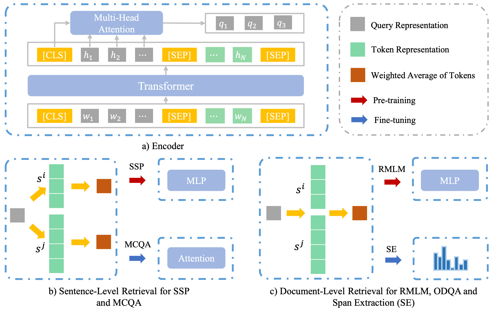

# REPT: Bridging Language Models and Machine Reading Comprehension via Retrieval-Based Pre-training

> A novel retrieval-based pre-training approach to bridge the gap between pre-trained language models and machine reading comprehension by strengthening evidence extraction capabilities.

## Authors

**Fangkai Jiao**<sup>1</sup>, **Yangyang Guo**<sup>1</sup>, **Yilin Niu**<sup>2</sup>, **Feng Ji**<sup>3</sup>, **Feng-Lin Li**<sup>3</sup>, **Liqiang Nie**<sup>1*</sup>

<sup>1</sup> School of Computer Science and Technology, Shandong University, Qingdao, China  
<sup>2</sup> Department of Computer Science and Technology, Tsinghua University, Beijing, China  
<sup>3</sup> Damo Academy, Alibaba Group, Hangzhou, China  
\* Corresponding author

## Links

  - **Paper**: [ACL/IJCNLP 2021 Findings](https://doi.org/10.18653/v1/2021.findings-acl.13) | [arXiv](https://arxiv.org/abs/2105.04201)
  - **Code Repository**: [GitHub](https://github.com/iLearn-Lab/ACL21-REPT)
  - **Checkpoints**: [Google Drive](https://drive.google.com/file/d/17ON33PBioseXMvM_mSunaUh9g-FhTJBC/view?usp=sharing)

-----

## Table of Contents

  - [Updates](#updates)
  - [Introduction](#introduction)
  - [Highlights](#highlights)
  - [Method / Framework](#method--framework)
  - [Project Structure](#project-structure)
  - [Installation](#installation)
  - [Checkpoints / Models](#checkpoints--models)
  - [Dataset / Benchmark](#dataset--benchmark)
  - [Usage](#usage)
  - [Experiments Scripts and Configs](#experiments-scripts-and-configs)
  - [Citation](#citation)
  - [Acknowledgement](#acknowledgement)
  - [License](#license)

-----

## Updates

  - [05/2021] Initial release of the paper on arXiv.
  - [05/2021] Release of code and pre-trained checkpoints (BERT and RoBERTa).

-----

## Introduction

This is the official implementation of the paper **REPT: Bridging Language Models and Machine Reading Comprehension via Retrieval-Based Pre-training**.

Pre-trained Language Models (PLMs) often struggle with evidence extraction, which requires reasoning across multiple sentences in Machine Reading Comprehension (MRC). To address this, we propose **REPT**, a framework that introduces two self-supervised tasks: **Surrounding Sentences Prediction (SSP)** and **Retrieval-Based Masked Language Modeling (RMLM)**. These tasks allow PLMs to learn evidence extraction during pre-training, which is then seamlessly inherited by downstream MRC tasks.

-----

## Highlights

  - **Effective Evidence Extraction**: Specifically designed to enhance reasoning across multiple sentences without explicit human supervision.
  - **Cross-Architecture Compatibility**: Successfully applied to both BERT and RoBERTa backbones.
  - **Robust Performance**: Outperforms standard PLMs on five major MRC benchmarks including RACE, DREAM, Multi-RC, Hotpot QA, and SQuAD 2.0.

-----

## Method / Framework



The REPT framework utilizes a pre-trained Transformer encoder and a multi-head attention-based query generator. It employs sentence-level retrieval for the SSP task and document-level retrieval for the RMLM task, ensuring the model learns to identify and utilize relevant context for answer prediction.

-----

## Project Structure

```text
.
├── configs/               # Configuration files for pre-training and fine-tuning
├── processors/            # Data processing and Wikipedia pre-processing scripts
├── scripts/               # Bash scripts for task-specific fine-tuning
├── main_wiki_pretrain.py  # Standard pre-training entry point
└── ...
```

-----

## Installation

### 1. Clone the repository

```bash
git clone https://github.com/iLearn-Lab/ACL21-REPT
cd ACL21-REPT
```

### 2. Environment Setup

The code requires PyTorch. We recommend the following versions used in our experiments:

  - **Pre-training**: `torch==1.6.0` (or `torch==1.5.1` for specific distributed environments).
  - **Dependencies**: `transformers`, `numpy`, `scipy`.

-----

## Checkpoints / Models

Pre-trained BERT and RoBERTa models are available for download:

  - **Download Link**: [Google Drive Checkpoints](https://drive.google.com/file/d/17ON33PBioseXMvM_mSunaUh9g-FhTJBC/view?usp=sharing)

Place the downloaded checkpoints in your local directory and update the `model_name_or_path` in the relevant `configs/` files.

-----

## Dataset / Benchmark

### Pre-training Data

We use the English Wikipedia dump. To prepare the data:

1.  Download the Wikipedia dump.
2.  Run the pre-processing script:

<!-- end list -->

```bash
cd processors
python wiki_en_pretrain_processor.py
```

### Downstream Benchmarks

The model is evaluated on:

  - **Multiple Choice**: RACE, DREAM, ReClor, Multi-RC.
  - **Span Extraction**: Hotpot QA, SQuAD 2.0.

-----

## Usage

### 1. Pre-training Data Construction

Construct the training samples with specific masking strategies:

```bash
python processors/wiki_en_mask_shuffle_wk5_mp.py \
    --input_file <path_to_wiki_data> \
    --seed 42 \
    --keep_prob 0.7 \
    --ratio "(0.8,0.1,0.3,0.0,0.0,0.0)"
```

### 2. Run Pre-training

```bash
python main_wiki_pretrain.py --config <path_to_config_json>
```

### 3. Fine-tuning

Execute the provided bash scripts for specific tasks:

```bash
# Example for RACE
bash scripts/race/bert_iter_sr_mlm_v1.sh

# Example for Multi-RC
python main_multirc_torch151.py --config configs/multirc/mlm_baseline/bert-base-sc-v1-mlm-2-0-20k.json
```

-----

## Experiments Scripts and Configs

### Pre-Training
#### BERT

|  model name     |  path      |
|  :-------       |  :------   |
|  BERT-Q w. R/S  |  configs/bert_pretrain/bert-iter-sr-mlm1.json               |
|  BERT-Q w. R/S (40k)    |  configs/bert_pretrain/bert-iter-sr-mlm2.json       |
|  BERT-Q w. R/S (60%)    |  configs/bert_pretrain/bert-iter-sr-mlm3.json       |
|  BERT-Q w. R/S (90%)    |  configs/bert_pretrain/bert-iter-sr-mlm4.json       |
|  BERT-Q w. S (No Mask)  |  configs/bert_pretrain/bert-iter-sr-no-mask-1.json  |
|  BERT w. M              |  configs/bert_pretrain/bert-mlm-baseline2.json      |
|  BERT-Q w. S            |  configs/bert_pretrain/bert-iter-sr1.json           |
|  BERT-Q w. R            |  configs/bert_pretrain/bert-iter-mlm1.json          |

#### RoBERTa

|  model name     |  path      |
|  :-------       |  :------   |
|  RoBERTa-Q w. R/S  |  configs/roberta_pretrain/iter_roberta/roberta-iter-sr-mlm-s2.json |

### Fine-Tuning

#### RACE

|  model name     |  path      |
|  :-------       |  :------   |
|  BERT-Q                 |  configs/race/bert-base-iter-mcrc-wo-pt.json       |
|  BERT-Q w. R/S          |  configs/race/bert-base-iter-mcrc-v1-3-0-20k.json  |
|  BERT-Q w. R/S (40k)    |  configs/race/iter_sr_mlm_2/bert-base-iter-mcrc-v1-4-0-40k.json |
|  BERT-Q w. R/S (60%)    |  configs/race/iter_sr_mlm_3/bert-base-iter-mcrc-v1-5-0-20k.json |
|  BERT-Q w. R/S (90%)    |  configs/race/iter_sr_mlm_4/bert-base-iter-mcrc-v1-6-0-20k.json |
|  BERT-Q w. S (No Mask)  |  configs/race/iter_sr_no_mask/bert-base-iter-mcrc-v1-sr-wom-0-20k.json |
|  BERT-Q w. M            |  configs/race/mlm_baseline/bert-base-iter-mcrc-v1-mlm-1-0-20k.json|
|  BERT w. M              |  configs/race/mlm_baseline/bert-base-mcrc-v1-mlm-1-0-20k.json   |
|  BERT-Q w. S            |  configs/race/iter_sr_1/bert-base-iter-mcrc-v1-iter_sr_1-0-20k.json|
|  BERT-Q w. R            |  configs/race/iter_mlm_1r/bert-base-iter-mcrc-v1-iter_mlm_1r-0-20k.json|
|  RoBERTa-Q w. R/S       |  configs/race/roberta_iter_sr_mlm_s2/rob-iter-mcrc-v1-s2-0-80k.json  |

#### DREAM

|  model name     |  path      |
|  :-------       |  :------   |
|  BERT-Q                 |  scripts/dream/bert_iter/mcrc1.sh       |
|  BERT-Q w. R/S          |  configs/dream/bert-base-iter-mcrc-3-6-20k.json     |
|  BERT-Q w. M            |  configs/dream/mlm_baseline/bert-base-iter-mcrc-v1-mlm-2-1-20k.json|
|  BERT w. M              |  configs/dream/mlm_baseline/bert-base-mcrc-v1-mlm-2-1-20k.json   |
|  BERT-Q w. S            |  configs/dream/iter_bert_sr/bert-base-iter-mcrc-iter_sr_1-1-20k.json|
|  BERT-Q w. R            |  configs/dream/iter_bert_mlm/bert-base-iter-mcrc-iter_mlm_1r-1-20k.json|
|  RoBERTa-Q w. R/S       |  configs/dream/roberta/iter_mcrc/rob-iter-mcrc-v1-0-sr-mlm-s2-80k.json|

#### ReClor

|  model name     |  path      |
|  :-------       |  :------   |
|  BERT-Q                 |  configs/reclor/iter_sr_mlm_1/bert-base-iter-mcrc-wo-pt-v1-0.json|
|  BERT-Q w. R/S          |  configs/reclor/iter_sr_mlm_1/bert-base-iter-mcrc-sr-mlm-1-v1-0.json|
|  BERT-Q w. M            |  configs/reclor/mlm_baseline_2/bert-base-iter-mcrc-mlm-baseline-2-v1-0.json|
|  BERT w. M              |  configs/reclor/mlm_baseline_2/bert-base-mcrc-mlm-baseline-2-v1-0.json   |
|  BERT-Q w. S            |  configs/reclor/iter_sr_1/bert-base-iter-mcrc-sr-mlm-1-v1-0.json|
|  BERT-Q w. R            |  configs/reclor/iter_mlm_1r/bert-base-iter-mcrc-mlm-1r-v1-0.json|

#### MultiRC

|  model name     |  path      |
|  :-------       |  :------   |
|  BERT-Q                 |  scripts/multi_rc/bert/bert_iter_sc_v3.sh|
|  BERT-Q w. R/S          |  scripts/multi_rc/bert/bert_iter_sc_v3.sh|
|  BERT-Q w. R/S (40k)    |  scripts/multi_rc/bert/iter_sr_mlm_2/bert_iter_sc_v3.sh|
|  BERT-Q w. R/S (60%)    |  scripts/multi_rc/bert/iter_sr_mlm_3/bert_iter_sc_v3.sh|
|  BERT-Q w. R/S (90%)    |  scripts/multi_rc/bert/iter_sr_mlm_4/bert_iter_sc_v3.sh|
|  BERT-Q w. S (No Mask)  |  scripts/multi_rc/bert/iter_sr_no_mask/bert_iter_sc_v3.sh |
|  BERT-Q w. M            |  scripts/multi_rc/bert/mlm_baseline_2/bert_iter_sc_v3.sh|
|  BERT w. M              |  configs/multirc/mlm_baseline/bert-base-sc-v1-mlm-2-0-20k.json|
|  BERT-Q w. S            |  scripts/multi_rc/bert/iter_sr/bert_iter_sc_v3.sh|
|  BERT-Q w. R            |  scripts/multi_rc/bert/iter_mlm_1r/bert_iter_sc_v3.sh|
|  RoBERTa-Q w. R/S       |  configs/multirc/roberta/iter_sc_v3_s2/rob-sc-v3-0-sr-mlm-s2-80k.json|


#### SQuAD 2.0

|  model name     |  path      |
|  :-------       |  :------   |
|  BERT-Q w. R/S          |  scripts/squad/iter_bert_qa_v1.sh    |
|  RoBERTa-Q w. R/S       |  scripts/squad/iter_roberta_qa_v1.sh |


## Citation

```bibtex
@inproceedings{jiao-etal-2021-rept,
    title = "{REPT}: Bridging Language Models and Machine Reading Comprehension via Retrieval-Based Pre-training",
    author = "Jiao, Fangkai and Guo, Yangyang and Niu, Yilin and Ji, Feng and Li, Feng-Lin and Nie, Liqiang",
    booktitle = "Findings of the Association for Computational Linguistics: ACL-IJCNLP 2021",
    month = aug,
    year = "2021",
    publisher = "Association for Computational Linguistics",
    url = "https://aclanthology.org/2021.findings-acl.13",
    doi = "10.18653/v1/2021.findings-acl.13",
    pages = "150--163"
}
```

-----

## Acknowledgement

This work was supported by the National Key Research and Development Project of New Generation Artificial Intelligence and the Alibaba Research Intern Program.

-----

## 📄 License

This project is released under the terms of the [LICENSE](./LICENSE) file included in this repository.
